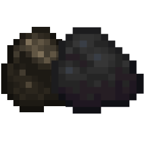

## CoalConverter

Lightweight simple plugin which lets you convert Charcoal to Coal and vice versa.

### Features
+ Change Coal into Charcoal (/coal)
+ Change Charcoal into Coal (/coal)
+ Adds custom recipes for converting Charcoal and coal.

### Commands & Permissions
#### Player section
| Command description | Command | Permission |
| --- | --- | --- |
| Converts (Char)Coal | /coal [amount] | coalconverter.coal |

#### Admin section
| Command description | Command | Permission |
| --- | --- | --- |
| Info plugion | /coalconverter | coalconverter |
| Reload plugin | /coalconverter reload | coalconverter.reload |
| Version plugin | /coalconverter version | coalconverter.version |
| Author plugin | /coalconverter author | coalconverter.author |
### Changelog
+ Release: v1.0.0

For any questions, discord me Jordi#7248

Feel free to submit issues and bugs from CoalConverter.

